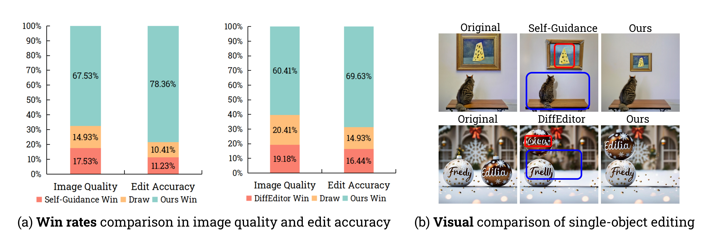
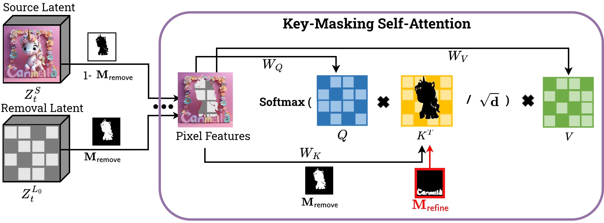
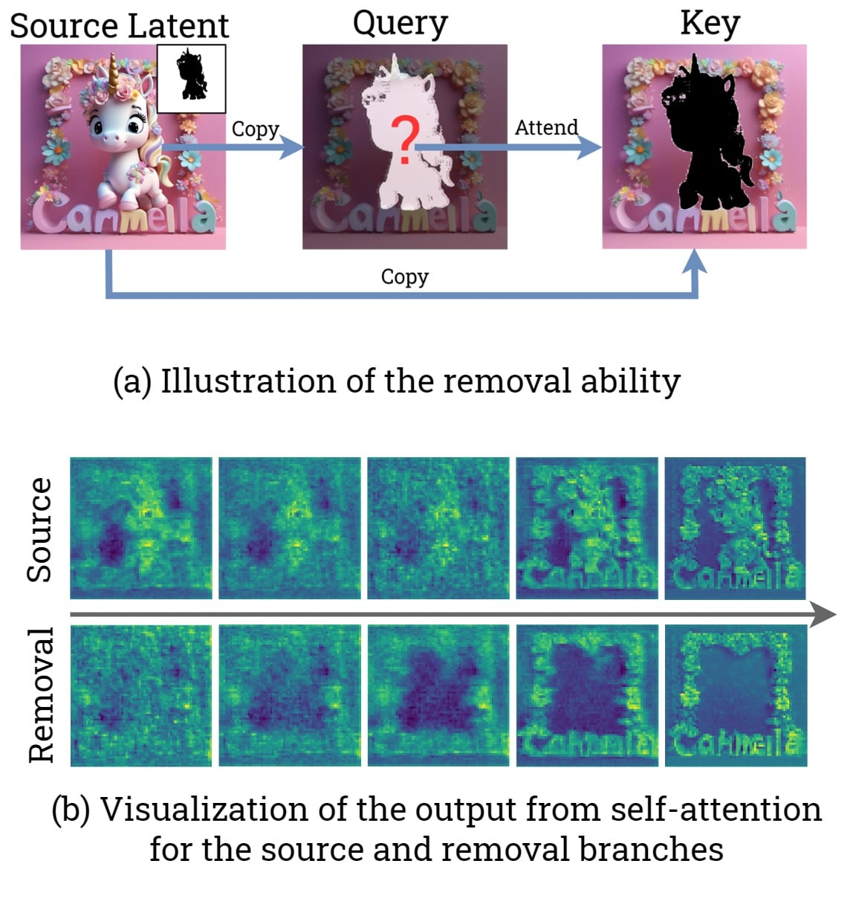
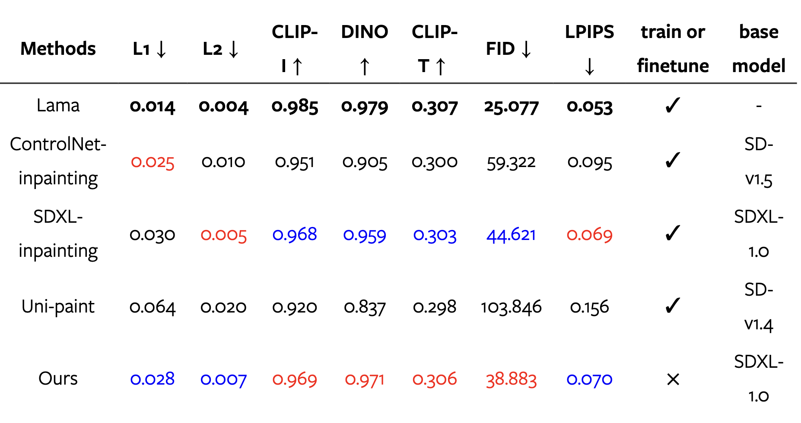
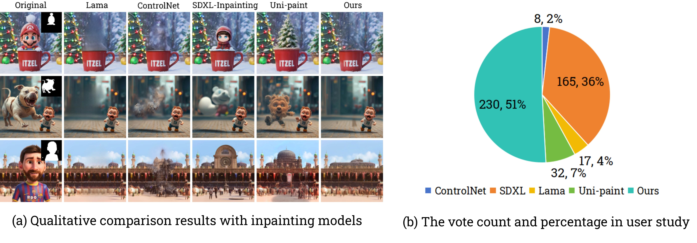
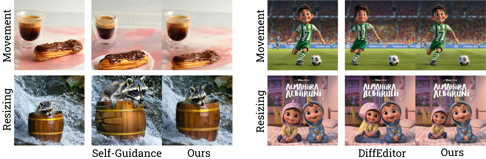
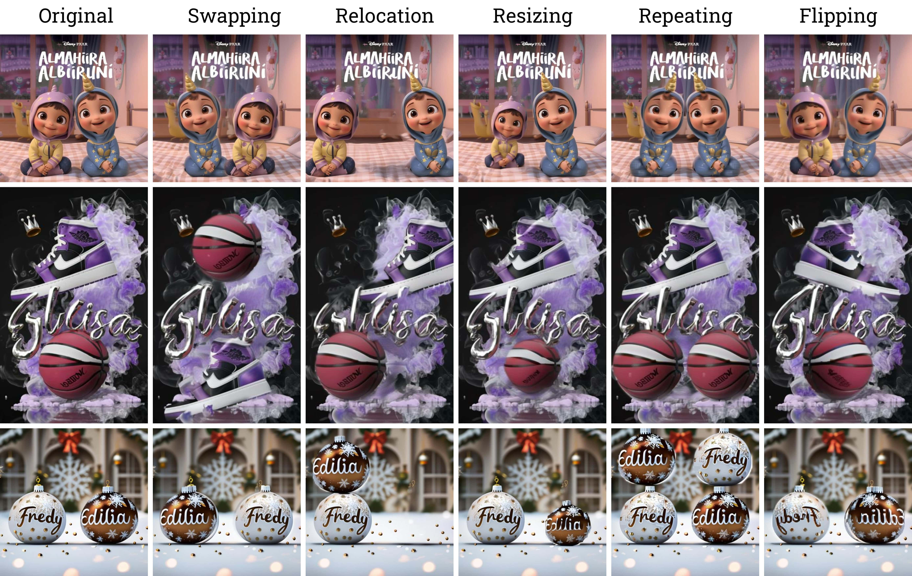
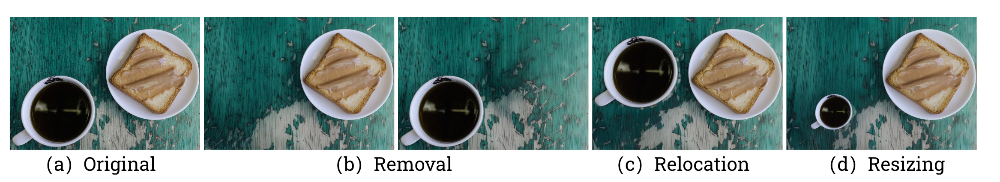
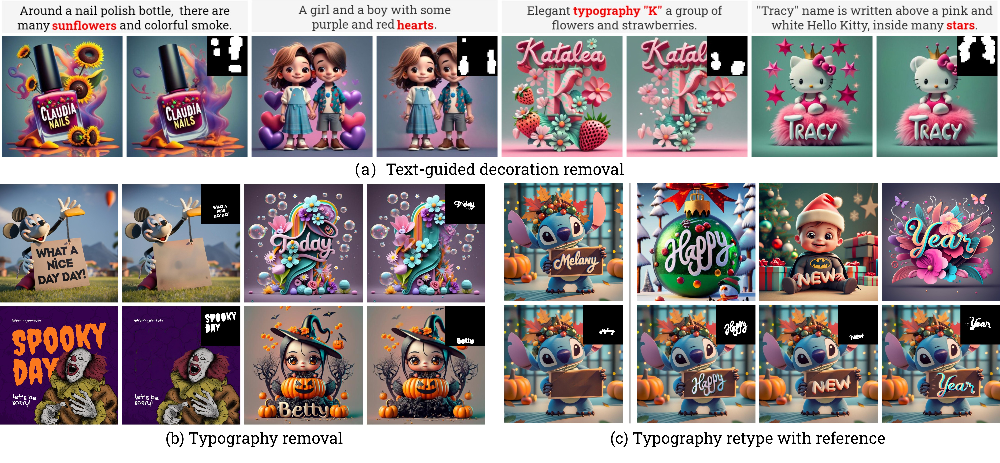

以下是论文翻译

## 摘要

近年来,如何实现精确的图像编辑越来越受到关注,特别是考虑到文本到图像生成模型的显著成功。为了将各种空间感知图像编辑能力统一到一个框架中,我们采用了设计领域的层概念,通过各种操作灵活地操作对象。关键的洞见是将空间感知图像编辑任务转换为两个子任务的组合:多层潜在分解和多层潜在融合。

首先,我们将源图像的潜在表示分割为多个层,其中包括几个对象层和一个需要可靠修复的不完整背景层。为了避免额外的调整,我们进一步探索了自注意力机制中的内在修复能力。我们引入了一种键掩码自注意力方案,该方案可以将周围的上下文信息传播到掩码区域,同时减轻其对掩码外区域的影响。

其次,我们提出了一种指令引导的潜在融合,将多层潜在表示粘贴到画布上。我们还在潜伏空间中引入了伪影抑制方案,以提高修复质量。由于这种多层表示固有的模块化优势,我们可以实现准确的图像编辑,并证明我们的方法始终优于最新的空间编辑方法,如Self-Guidance和DiffEditor。

最后,我们展示了我们的方法是一个统一的框架,可以在六个以上的不同编辑任务上支持各种准确的图像编辑任务。

![[Uncaptioned image]](./x1.png)

图 1：视觉设计图像编辑实例。我们的方法借助无需训练的统一框架推动了一系列图像编辑操作，从而实现设计图像的精准空间感知式编辑。我们的方法能够同步操作不同对象，并同时施行各种操作。所有结果均通过一种扩散去噪过程生成。

## 1. 简介

图 2. 我们的方法与 Self-Guidance 和 DiffEditor 之间的对比。我们在（a）中汇报了图像质量和编辑准确性的胜率对比。针对每次对比，我们选取了 10 个包含移动和调整大小等多种操作的示例。要求用户就图像质量和编辑准确性这两方面进行投票。“平局”选项表示效果相同。我们收集了 73 名用户的答案，每个指标总计有 1460 票。

尽管通过训练大规模的文本到图像扩散模型在图像生成方面取得了巨大成就[18、23、27、26、10、15]，正如近期具有开创性的研究，包括 SDXL[21]、DALL·E3[19、3]和 Ideogram1 所展示的那样，这些模型面临着需要具备数字能力或空间排列能力的提示所带来的挑战。例如，图 1（a）展示了由 DALL·E3 生成的一幅引人入胜的故事书设计图像，其文字提示描述了“三只小猪”的故事。我们发现图中有四只猪，这与文字提示中的“三只猪”不相符。为了克服这些限制，前沿的努力[9、17、28、16]已经致力于开发精确的空间感知图像编辑技术，旨在弥合用户期望与初始生成结果之间的差距。

与之前的方法[9、17、28、16]需要结合为不同编辑任务设计的多种编辑指导方案，并通过额外的反向传播来更新潜在表示不同，我们为精确的空间感知图像编辑任务提出了一种无需训练、仅向前、且统一的框架。我们的方法将大多数具有代表性的空间感知编辑任务转化为一个双重过程。该过程首先根据精确的用户指令和层分割掩码来分解源图像的多层潜在表示，然后按照准确的布局排列将这些表示集成到目标图像中。为了确保多个图像层的精确空间感知编辑质量，我们根据目标布局排列明确融合多层潜在，以形成目标潜在表示。此外，我们支持利用 GPT-4V[34]的推理和视觉规划能力来协助制定用户指令并生成（和完善）准确的布局安排。

我们明确了执行多层潜在分解与融合过程中的关键挑战，并提出了以下三个非平凡的技术贡献：

1. 首先，我们发现执行多层潜在分解的关键挑战之一在于生成高品质的背景层。该层不仅要对原始层保持忠实，还需修复分解对象层中的不完整区域。我们没有采用现有的修复方法，而是引入了一种极为简单却更可靠的self-attention[31]key-masking方法，其能一直达成更佳的修复质量。
2. 其次，我们需要解决的另一个挑战是修复区域可能会受到一些无关区域的负面影响，从而产生瑕疵。因此，我们提出了一种瑕疵抑制方案以进一步提升修复质量。
3. 第三，我们通过将各种图像编辑任务分解为两个基本子任务，引入了一个统一的框架：多层潜在分解与多层潜在融合。

我们开展了广泛的用户研究，以评估我们方法的图像编辑质量，并将其与 Self-Guidance[9]和 DiffEditor[17]的最新进展进行对比。结果在图 2 中展示，呈现了在两个关键维度上的胜率：图像质量和编辑保真度。我们的研究结果表明，我们的方法在各类编辑任务，如对象移动和尺寸调整上，明显优于这两种基准方法。

此外，我们还将我们的方法应用于一系列具有挑战性的设计图像编辑任务，例如对象移除、尺寸调整、移动、重复、翻转、相机平移、缩小、合成多个图像以及编辑版式或装饰等。我们期望能推动更精确的空间感知图像编辑技术的进一步发展。

图 3：展示我们方法的整体框架：在多层分解阶段，给定用户的编辑指令和源图像，我们首先使用 GPT-4V 执行指令规划，生成一组详细的分层编辑指令。接着，我们将源图像分割成多个图像层，包括需要额外进行修复的背景层（由新颖的关键掩码自关注方案来实现）以及要操作对象的其他对象层。

对于多层融合阶段，我们依据层的顺序和逐层指令的顺序，依次将它们粘贴到潜在空间的画布上。我们进一步应用多个去噪步骤来协调融合的多层潜在表示。此外，我们还进行瑕疵抑制以提升背景修复质量。

## 2. 相关工作

### 2.1 潜在扩散模型

潜在扩散模型[24]（LDM）通过在压缩的潜在空间操作，而非在图像层面操作，为生成式建模领域引入了一种开创性的方法。此方法加快了生成过程，降低了计算需求。近来，采用潜在扩散模型架构并经过大量数据训练的大规模条件扩散模型[24, 21, 27]，能够生成细节丰富且视觉上引人注目的图像。像混合潜在扩散[2]等图像编辑方法表明，在潜在空间操作可实现比在图像层面操作[1]更快的推理速度和更高的精度，来完成局部图像调整。在我们的工作中，我们采用了最先进的大规模文本到图像 LDM，即具有 U-Net 结构[25]的稳定扩散[24, 21]，以进一步探索用于空间感知图像编辑的潜在操作。

### 2.2 引导驱动的空间感知图像编辑

空间编辑是指通过考虑图像内的空间上下文和关系来修改图像。与就地编辑方法[12, 5, 13, 4]不同。受扩散模型分类器引导策略的启发，无训练布局控制[7]和 Boxdiff[32]利用位置信息损失来约束潜在空间，以实现带有布局控制的空间感知图像生成。自我引导[9]将分类器引导引入基于扩散的图像编辑，以完成如对象移动和调整大小等任务。受 DragGAN[20]启发的 DragonDiffusion[16]，将基于拖动的图像编辑任务融入扩散模型，扩展到更多空间感知的编辑任务，如使用对象蒙版等图像提示的对象移动和调整大小。DiffEditor[17]改进了 DragonDiffusion，在精确图像编辑任务中达到了最先进的结果。

这些引导驱动的方法[6, 35, 39, 9, 16, 17]依赖于反向损失，导致各种元素相互纠缠，使得难以同时对不同对象执行不同操作。我们通过多层分解解决该问题，利用层的灵活性来实现更复杂和通用的编辑任务。另一方面，损失是一种软约束，它会忽略或改变相对像素级特征，可能导致对象和背景身份的变化。

我们的多层融合策略直接遵循潜在空间中的逐层编辑指令。此外，我们的方法有助于对象移除，其性能与专门训练或调整的修复模型相当，这是引导驱动方法所欠缺的能力。

## 3 方法

图 4：时间步 t 处的关键屏蔽自注意力机制。该图展示了去除潜在表示的  $Z^S_t$ 在时间步 t 的示意图。像素特征的周边由原始的潜在表示 $Z^S_t$ 保持。$𝐌_{𝗋𝖾𝗆𝗈𝗏𝖾}$ 和 $𝐌_{𝗋𝖾𝖿𝗂𝗇𝖾}$ 作为关键特征，以减少掩码内的注意力。

我们工作的关键理念在于提出一种无需训练的多层分解和融合框架，能够统一各种空间感知图像编辑任务。首先，我们解释了多层潜在分解阶段的详细设计，该阶段根据一组对象分割掩码，得到不同对象的精确分层潜在表示。此外，我们利用 GPT-4V 的推理和规划能力，通过提供几个上下文示例，将用户编辑请求自动转换为结构化的、分层的编辑指令。其次，我们展示了一种多层潜在融合方案，该方案根据目标布局画布集成多个潜在表示，该画布可以由人的输入或 GPT-4V 提供。

最后，我们通过应用额外的扩散步骤，来增强融合目标潜在表示的协调性。此外，我们引入了一种伪影抑制精炼策略，以检查和增强背景去除的有效性。图 3 说明了我们方法的整体流水线。

### 3.1 多层潜在分解

受设计领域中层次概念的启发，我们引入了多层潜在分解方案，将复杂的图像编辑过程简化为一组独立、易于管理的针对每个图像层的分层编辑操作。在本研究中，我们将“层”概念化为源图像中，要么是单个基本视觉元素，要么是多个视觉元素的集合。每一层都可以独立调整、移除或与其他层合并，有助于精确操纵最终的图像构成。

给定源图像和编辑指令，我们需要分层编辑指令以及多层潜在表示。更多细节如下。

#### Layer-wise Editing Instruction Planning

此步骤的关键思想是利用 GPT-4V 的推理和规划能力，将模糊的用户编辑指令转化为详细清晰的分层编辑指令。我们支持两种空间编辑指令：

* “调整大小”，使用高度和宽度比率调整大小；
* “移动”，使用方向和比例调整位置。层的顺序取决于在画布上粘贴的顺序。层 0 作为背景层，而层 1 到层 N 作为实例层。

#### Layer-wise Mask Segmentation and Adjustment

在生成分层编辑指令后，我们继续进行分层掩码分割，目的有两个：通过key-masking self-attention方案进行对象移除，以及作为构建布局画布的基础元素。我们注意到一个有趣的点：仅调整分层潜在表示可能会导致模糊和瑕疵。为了解决这个问题，我们同时调整初始图像和掩码的大小，然后将调整后的图像编码到潜在空间中，同时保持对象的中心位置不变。

#### Key-Masking Self-Attention

然后我们通过反转技术将准备好的层图像编码到潜在空间中[11]。我们在潜在扩散模型的 U-Net 结构中引入了一种新颖的 key-Masking self-attention 方案，以去除 Layer-0 掩码区域并保持背景的整体和谐。

Key-Masking Self-Attention 在初始 K 扩散步骤期间将掩码 $M_{remove}$ 应用于自注意的 KEY 特征。计算过程描述如下：

$\text{Softmax}\left(\frac{\mathbf{Q}\left((1-\mathbf{M}_\text{remove})\odot\mathbf{K}\right)^\mathrm{T}}{\sqrt{d}}\right)\mathbf{V},\\\text{where Q, K, V come from the removal latent features }\mathbf{Z}_T^{\xi_0},\text{projected by }W_Q,W_K,W_V.$

为了保留掩码外的区域，我们从反转路径提供的源潜在变量$\mathbf{Z}_t^S$复制周围特征。$\mathbf{Z}_T^{\mathcal{L}_0}$由$\mathbf{Z}_T^S$初始化。如$\color{red}{图 4}$所示，在每个去噪时间步$t$，我们更新去除潜在变量$\mathbf{Z}_t^{\mathcal{L}_0}$以保留最新的周围特征。

$$
\mathbf{Z}_t^{\mathcal{L}_0}=\mathbf{Z}_t^{\mathcal{L}_0}\odot\mathbf{M}_\text{remove}+\mathbf{Z}_t^{\mathcal{S}}\odot(1-\mathbf{M}_\text{remove}).
$$

图 5. 展示了关键掩码自注意力机制。(a) 表示掩码内的区域仅从掩码外的区域查询信息，这些信息是从源潜在表示中复制而来以完成信息。(b) 呈现了源潜在表示和移除潜在表示随时间变化的输出热图。这些热图来自分辨率为 64×64 的第一个自注意力块。

由于注意力权重是通过Query和Key的匹配来计算的，如果一个Key被屏蔽，那么任何与该Key匹配的Query的匹配程度都会非常低。这导致与掩码区域对应的Key在加权和计算中不被考虑。

图5（a）说明了通过对关键特征应用掩码，使查询能够忽略掩码内部的区域，只关注剩余区域。掩码内部的区域是通过逐步保留由$\mathbb{Z}_t^s$保留的剩余区域来重建的。

图5（b）可视化了来自源潜在变量$\mathbf{Z}_t^{s}$和去除潜在变量$\mathbb{Z}_t^{\ell_0}$的自注意力输出特征的热图。我们观察到，与掩码区域对应的信息在最终输出中被抑制，得到的注意力分数较低，而与周围背景的过渡则是渐进的。

### 3.2 Multi-Layered Latent Fusion

表 1：空间感知图像编辑任务的统一概述。“Source”表示移除前的初始潜在特征，如公式（1）和（2）中所定义。“Removal”是指在公式（1）和（2）中应用键屏蔽自注意力的潜在特征。“Target”潜在特征用于解码最终输出。“Fusion step t”是实施公式（3）的范围。

这是一个关于"Instruction-Guided Latent Fusion"算法的介绍文章。以下是该文章的主要内容:

#### Instruction-Guided Latent Fusion

在背景层 $L_0$ 的前 $K$ 步移除之后，我们顺序地将准备好的分层潜在特征粘贴到时间步长 $T - K$ 的布局画布潜在表示 $Z_t^c$ 上,并使用逐层的"Move"指令 $V_i$。

给定一个二维操作向量 $v = (dx, dy)$, 我们定义操作 $Move(I; v) : B \times C \times H \times W \to B \times C \times H \times W$ 如下:

$I(i, j) = Move(I; v)(i, j) = I(i - dx, j - dy),$

其中 $B$ 是批量大小, $C$ 是通道数, $H$ 和 $W$ 分别是图像的高度和宽度。该操作将潜在特征和掩码沿特定方向移动并对其进行缩放,以实现对象移动。

在时间步长 $t = T - K$ 时,首先使用 $Z_0^c$ 初始化布局画布潜在表示 $Z_t^c$,然后对于每个层 $L_i, i = 1, 2, ..., N$ 和每个操作向量 $v_j \in V_i$, 我们记 $M_j = Move(M_i; v_j)$,潜在融合过程由以下方程描述:

$Z_t^c = Z_0^c \odot (1 - M_j) + Move(Z_t^i; v_j) \odot M_j.$

融合潜在的协调为了增强层之间的边缘融合并解决接口处的突然变化，我们在连续分层之后，在扩散过程的最后 T−K 去噪步骤进行协调处理。这种方法细化了混合并减少了层边界处的视觉差异，提高了图像质量和真实性。

图 6：（a）和（b）显示了板内的文本移除，而（c）显示了靠近文本附近区域的移除。

“Artifact Suppression Refinement 通过对填充后的背景图像进行解码，我们可以检查去除结果。例如，如图 6 (a) 和 (b) 所示，电路板元素在设计图像中很常见，从电路板中去除太多内容可能会导致部分缺失。在某些情况下，扩散模型也很难识别风格化的字体，因此它往往会在去除区域中扩展它们，如图 6 (c) 所示。为了解决这个问题，我们引入了一个精制过程，即伪迹抑制。其核心思想是引导模型避免关注导致伪迹的部分，这些部分由𝐌𝗋𝖾𝖿𝗂𝗇𝖾 识别。𝐌𝗋𝖾𝖿𝗂𝗇𝖾 与关键屏蔽自注意机制中的𝐌𝗋𝖾𝗆𝗈𝗏𝖾 一起应用；它不影响方程 (1) 中的潜在操作。这个精制过程使我们能够在从源图像中去除内容方面达到高成功率。修改后的关键屏蔽自注意机制是：

### 3.3 空间感知图像编辑任务的统一

第 3.1 和 3.2 节提出了一种用于图像编辑的多层表示的通用框架。借助此框架，我们可以将表 1 中各种基本的空间感知编辑操作及其扩展统一起来： 通过对“Removal”潜在层应用 Key-Masking Self-Attention，如公式（1）和（2）所述，可以实现从“Source”潜在层中删除掩码区域，从而实现多层分解。通过对“Canvas”潜在层$\mathbb{Z}_t^{O}$应用公式（3）来执行多层潜在融合。 对象删除、移动、调整大小和翻转 这些是基本的编辑操作。调整大小和翻转需要在编码之前对源图像进行图像级别的调整，添加额外的层。移动是在融合阶段执行的。Mremove 是需要操作的所有对象的掩码的并集，表示为$\sum$Mobj$\cdot$。 相机平移和缩小 通过调整初始图像并生成两个特定的掩码，我们可以将相机平移和缩小任务转换为删除任务。我们平移或缩小源图像，并将其粘贴到原始画布上，以初始化移除区域，并使用其相邻区域，确保平滑过渡和颜色一致性。如图 73 所示，对应原始图像的区域设置为 o，其余需要完成的区域设置为 1。在方程式（j）和（z）的 T$\sim$T-K 移除阶段，我们只需将 Mremove 替换为$\mathbf{M}_\mathrm{pan}/$zoom·。

Figure 7:**Illustration of the mask usage in camera panning and zooming out tasks.** The figure presents two cases of image adjustment and the formation of their related masks.

图 8：说明了在时间步 t 进行的集成分解。为了重新定位狗和球并填充被遮挡的狗腿，我们分别对背景潜在层$\mathbf{Z}_t^{\ell_0}$和画布潜在层$\mathbf{Z}_t^{\ell_0}$进行两次 Key-Masking Self-Attention。$\hat{M}_\mathrm{occlude}$表示带有遮挡的第一层$\mathbf{z}_t^{e_1}$的移动后的$\mathbf{M}_\mathrm{occlude}$。目标潜在层是新的画布移除潜在层$\hat{Z}_t^{e}$。

表 2：针对掩码引导对象移除任务的 MagicBrush 测试集的定量研究。加粗、红色和蓝色代表前三名结果。我们的方法是唯一不需要训练或微调的方法，并且在 51 个示例中，它在 7 个指标上取得了与 SDXL-Inpainting 相当的结果。其他方法都是专门针对掩码引导图像修复进行训练或微调的。

遮挡感知对象编辑

请注意，对象通常不会完全出现在源图像中。例如，在图 8 中，狗的一条腿被球挡住了。直接重新定位会导致不完整的失败。我们提出了一种称为集成分解融合技术的新策略，充分利用了 Key-Masking Self-Attention 的修复能力。 说明流程见图 8。对于前 K 个扩散步骤的每次迭代，除了对$\mathbf{Z}_t^{\ell_0}$进行背景移除外，我们首先使用方程式（3）对画布潜在层执行融合操作，然后引入一个新的掩码$\mathbf{M}_{\mathrm{occlude}}$，在这种情况下，它是初始球掩码。在这种情况下，移除潜在层由画布潜在层$\hat{Z}_t^{\mathcal{C}}$表示，该潜在层由源潜在层$\mathbb{Z}_t^{O}$引导： $\hat{\mathbf{z}}_t^C=\hat{\mathbf{z}}_t^C\odot\hat{\mathbf{M}}_\text{occlude}+\mathbf{Z}_t^C\odot\binom{1-\hat{\mathbf{M}}_\text{occlude}}{}$。

我们将$\hat{M}_{\mathrm{occlude}}=\sum_{\upsilon_j\in V_i}^{\mathrm{Move}}\left(\mathbf{M}_{\mathrm{occlude}};\mathbf{v}_j\right)$表示为在遮挡的第 i 层$L_{i}$移动后掩码的总和。KeyMasking 机制是在画布潜在层$\hat{Z}_t^C$上用$\hat{M}_\mathrm{remove}$替换方程式（j）中的$M_\mathrm{occlude}$。集成分解融合技术是一种更通用的融合策略，在非遮挡图像编辑上下文中，它等于在$t=T-K$时的一步融合，后者具有较低的计算成本。

 跨图像合成 我们的方法可以通过编码背景参考图像$(\mathbb{Z}_t^{Bg})$和一组前景图像来支持跨图像合成。分层指令和顺序由新的布局设计给出。

## 4 实验细节

我们使用了 SDXL-1.0[21]的冻结权重，并在分辨率为 1024x1024 的情况下生成了图像。作为潜在扩散模型，SDXL-1.0 的潜在空间分辨率为 128x128。我们采用了最先进的扩散反演技术 Proximal-Guidance[11]，将源图像反演到潜在空间，并使用了 50 步的 DDIM[29]去噪过程，即$T=50$。我们选择了$K$的最有效值，即$K=40$。关键屏蔽自注意力被应用于 SDXL-1.0 中的所有$z_0$自注意力块，范围为$\begin{bmatrix}50\sim10\\\end{bmatrix}$。

图 9：与其他掩码引导的修复模型的比较。(a) 展示了对大物体移除能力的定性比较，我们的方法不会导致明显的模糊或使用无关元素填充移除区域。(b) 显示了来自 113 名用户的 452 票的用户研究结果，我们的方法获得了 51%的偏好百分比。

图 10：在 MagicBrush 数据集上的定性比较。我们选择了掩码提供的指令引导的移除任务来评估我们方法的修复能力。第三列显示了 DALL·E2 提供的移除结果作为 ground truth。我们将 LaMa、ControlNet-Inpainting、SDXL-inpainting、Uni-paint 的结果与我们的结果进行了比较。

### 4.1Comparison to State-of-the-art

目标移除 我们在 MagicBrush 基准测试[36]上，将我们的方法与其他 5 种专门用于修复任务的方法进行了比较：Lama[30]、ControlNet-inpainting[37]、SDXL-inpainting 和 Uni-paint[33]。在我们的实验中，我们使用了仅涉及移除的指令数据，总共有 51 个例子，每个例子都包括由 DALL·E2[23]生成的 ground truth 图像用于评估。 我们在 7 个指标上评估了我们的方法和掩码引导的图像编辑方法的性能。L1 和 L2 用于衡量目标图像和 ground truth 之间的像素级差异。CLIP-I[22]和 DINO[8]用于评估图像质量，CLIP-T 用于测试文本-图像对齐。我们还使用 LPIPS[38]来测量补丁级别的感知差异，FID[14]用于评估真实和生成图像特征分布的相似性。图 2 中的定量结果显示了专门为修复训练的 Lama 的绝对优势。我们的方法在 7 个指标上的结果与 SDXL-Inpainting 相当，但不需要任何微调。 用户被要求根据清晰度、部分恢复和边缘质量进行选择。我们收到了来自 113 名用户的 452 票，结果显示在图 9（b）中，证明了我们方法的卓越性能。请注意，尽管 Lama 在基准测试中表现最佳，但在移除大面积时会产生明显的模糊伪影，如图 9（a）的第二列所示。这就是为什么它在用户研究中获得的票数较低的原因。

Figure 11:**More qualitative comparisons with Self-Guidance and DiffEditor.** 我们进行了移动（第一行）和调整大小（第二行）的单一物体编辑任务。(a) 中的结果来自 Self-Guidance 的原始论文。

Figure 12:**The ablation study of different mask placements and effect range of self-attention.** (a) 展示了不同掩码效应范围下的去除结果。(b) 可视化了在效应范围[50∼10]下不同时间步长的自注意力输出，与（a）中蓝色框突出显示的设置相同。

Figure 13:**The ablation study with zooming out task.** (a) 展示了在图像级别和潜在级别上的不同调整大小位置。(b) 展示了具有原始图像、黑色画布和白色画布的不同初始化方法。

### 4.2 消融实验

#### 关键掩码自注意力的影响范围

通过在整个范围 `[50∼0]` 上实现方程式（2）来保持周围特征与源图像一致，我们研究了哪种影响范围导致最有效的移除。正如图 12（a）的第二行所示，在前 10 个关键掩码步骤内可以实现显著的移除，而范围 `[50∼10]` 更有效地整合了边缘并更好地与背景融合。因此，我们在所有编辑任务中使用 `β=40` 作为我们的最佳设置。

#### 自注意力机制中的掩码定位

我们比较了不同掩码定位的移除结果，如 图 12（a）所示。屏蔽查询会使移除区域模糊。正如图 12（b）中红色框所示，在注意力计算期间，掩码区域的重要性降低，导致相应像素的清晰度降低。将掩码应用于值会损坏或破坏掩码区域内的像素，因为这些像素被分配了错误的值，从而扭曲了生成的图像。值得注意的是，在掩码区域周围的自注意力输出中，掩码关键字会产生平滑过渡，确保与周围信息的更一致的集成。

#### 分层大小调整：潜在与图像

我们在多层分解阶段调整图像大小，这与潜在级别的位置调整不同。在这里，我们比较了两种调整大小的方法，并以缩小任务为例，这可以被视为原始图像的全局调整大小。如 图 13（a）所示，潜在级别（蓝色圆圈突出显示）的调整大小会改变女孩脸部的细节，并且往往会变得模糊，失去细节，导致原始图像和目标图像之间的不一致，从而影响准确性。 主要有两个原因。首先，分辨率差异：图像级别的分辨率为 `1024×1024`，而潜在级别的分辨率为 `128×128`。潜在级别的分辨率要低得多，导致信息密度显着降低。其次，信息丢失和压缩：在潜在空间中调整大小本质上意味着进一步处理已经由模型抽象和压缩的表示。由于这个过程的非线性和复杂性，每个特征点代表了关于图像的更抽象、更高级别的信息。 因此，在潜在级别调整大小更有可能导致这些高级特征的丢失，从而导致详细信息的丢失。由于与图像级别的调整相关的额外编码和反转成本，我们选择在潜在级别进行位置调整，这已经产生了令人满意的结果。

#### 额外画布初始化：原始画布与黑色画布与白色画布

对于相机平移和缩小任务，我们首先平移或缩小初始图像到目标位置，然后将其粘贴到初始图像上。这种方法有效地使用周围区域初始化掩码内的区域。使用原始画布初始化实际上为模型提供了填充的线索和预期内容，从而能够生成与周围环境一致的细节。此外，模型试图保持这种连贯性，从而产生与原始图像相匹配的内容。 如 图 13（b）所示，我们针对缩小任务探索了另外两种初始化方法：黑色画布和白色画布。观察到第一种方法使用与周围环境一致的复杂细节来填充未知区域，有效地扩展了云层、花朵和女孩手臂。然而，第二种和第三种方法导致填充区域不连贯甚至不协调。这是因为模型接收到“空白信号”，并且仅依赖自注意力机制的查询来生成与原始图像紧密相关的复杂细节具有挑战性。

### 4.3 More Qualitative Results

**Multi-Object Complex Editing** 我们展示了在复杂操作中的多对象编辑能力，例如图 14 中的移除，图 15 中的交换、移动、调整大小、添加和翻转，以及图 16 中的跨图像合成。所有结果都是在一轮中生成的。

Figure 14:**Qualitative results of applications on design images.** 该图显示了对单个（第二和第三列）和多个对象（第四列)的移除结果，包括对大区域和小区域的移除。

Figure 15:**Qualitative results of applications on design images.** 该图显示了具有文本元素的双对象中心设计图像的基本编辑操作。

Figure 16:**Qualitative results of applications on design images.** 该图显示了背景和前景对象及其层序。

逼真的图像编辑 第 4.1 节和图 10 显示了在逼真数据集 MagicBrush 上的移除能力。这里我们提供了更多不同编辑操作的定性结果，图 17。

Figure 17:**Qualitative results of photorealistic image editing**. 我们进行基本的编辑操作，以展示我们的通用编辑能力，这不仅限于设计图像。

设计图像应用 图 19（b）说明了使用交叉注意力掩码进行文本引导的装饰移除任务，这些掩码过于不规则和众多，无法手动屏蔽。图 19（b）和（c）显示了设计图像上对象移除和跨图像合成的排版编辑应用。图 18 显示了海报编辑结果。图 20 显示了设计图像上的相机平移和缩小结果。

Figure 18:**Qualitative results of photorealistic image editing**. 我们展示了 DALL·E3 海报（a）和手工海报（b)的移除和重新设计结果。

Figure 19:**Qualitative results of applications on design images.** a）显示了使用交叉注意力掩码进行装饰移除的结果，相关令牌用红色标记。（b）和（c)展示了排版编辑的结果。

Figure 20:**Qualitative results of camera panning and zooming out tasks.** （a）展示了相机平移的定性结果，方向为上、下、左、右，比例为 0.2×H 或 0.2×W。（b)显示了 1.25 和 1.5 比例的缩小结果。

## 5 总结

在这项研究中，我们提出了一种多层潜在分解和融合框架，该框架统一了各种空间感知图像编辑操作，无需额外调整。为了提高图像编辑的精度，我们引入了两种创新技术：关键掩蔽自注意力方案和伪影抑制方案，旨在提高背景图像层和被遮挡对象层的质量。此外，我们利用先进的 GPT-4V 模型的布局规划能力来进一步完善我们的方法。最后，我们通过全面的定量和定性比较，经验性地验证了我们的方法在各种图像编辑任务中的优越性，特别是在具有挑战性的设计图像领域。
